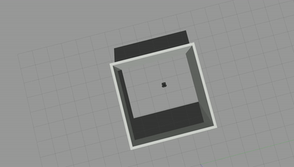
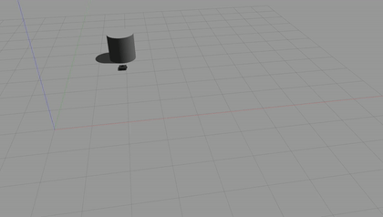

# warmup_project
## Walking in Square
### high-level description
 My approach for this problem involved having the robot go in a forward direction for a fixed amount of time before turning for a fixed amount of time until it reached approximately 90 degrees and repeating this behavior 4 times before stopping.
 ### code explanation
My code was all written within one class called SquareWalk. This class had an *__init__* method and a *run* method. The *__init__* initialized the node and publisher to cmd_vel, while the *run* method contained the meat of the code involving what was described above. Within *run*, I first defined the Twist velocities for my three states: forward, turning, and stopping. Then, I wrote the loop that published going forward followed by sleeping for a fixed time followed by turning and sleeping before repeating. Finally, I set Turtlebot to 0 velocity before escaping.
### gif
Here is what it looks like after running:

## Following Wall
### high level description
My approach for this problem was to split the robot behavior into 3 parts. First, finding the closest wall and moving towards it. Second, turning so that the bot is parallel to the wall and following it. Finally, turning to follow the next wall. 
### code explanation
My code was all written all in a class called WallFollower. After the node was intialized, there are 4 main functions in my code. The first function is called find_wall. This function serves to find the wall and move the robot to be closer to it. The second function is follow_wall, which serves to turn the bot to be perpendicular wall and continue forward until it runs into a corner. The third function, turn, makes the bot turn at corners. Finally, process_scan cycles between the top states depending on readings from the scanner. 
### gif

## Following Person
### high-level description
My approach for this problem involved a very similar approach to finding the wall in the last problem by turning towards the closest object and then moving with some velocity towards it. 
### Code explanation
The code is written within a class called FollowPerson. It involves first initializing the scan and cmd_vel topics and the node. The function to process the scan data, *process_scan*, does all of the heavy lifting in the code. It takes in the scan data and finds the minimum distance value and index. Then, it sets constants for proportional control of velocity and the max velocity before setting the anglular difference to be centered around where the bot faces. It also calculates the difference between the distance an the desired distance. Then, it finds the appropriate behavior based on scan conditions. If the desired distance away is greater than the limits of the scan, the bot stops moving. Else if the bot is roughly facing the object, it goes forward and slightly turns with proportional control to move toward it. Finally, if the bot is not facing the object, it slight goes forward while mainly turning. Finally, the data is published. 
### gif

## Changes, challenges, and Biggest Takeways Part 1 (know they were unnecessary in retrospect)
My biggest challenges were making sure my publisher was connected before trying to set the right values for my velocity. At first, my publisher did not get connected in time, and the turtlebot remained stationary, but I remedied this by having a while loop that checked to make sure my publisher was connected before executing any commands. My second challenge involved setting the correct velocities. At first, I set the velocities too large and the turtlebot would move quite sporadically. Then, I set the velocities to less than 1 for both the angular and linear velocity and my robot moved correctly. To get it to turn correctly, I had to set the angular z velocity when at first I was trying to set the angular x velocity. I also just experimented around with values starting from the fact that pi/2 radians is about 1.6 and with a speed of 0.2 rad/sec, I should turn around 8 secs.
If I had more time, I would instead use the /odom topic to ensure that the robot was turning exactly 90 degrees at each turn because I do think my turns could be a little more accurate.
My key takeaways are that I need to check to make sure that all publishers and subscribers are connected before trying to use them. I feel that I could run into a bug easily where I expect the robot to move or a value to be read, but not get the correct outcome due to not connecting. Additionally, I learned that lower values for velocity are favored to get the robot to perform actions precisely. When I put in values over 1, the robot seemed to sometimes move in less straight paths and it was difficult to coordinate turning correctly.
## Part 2 
## Challenges
My biggest challenges were mainly with **wall follower**, while **person follower** was easier after facing most of the challenges with the wall. First, I had to find good values for all of my constants for proportional control. This took me a while to tune with every step and I still feel like I could do with some more adjustment. A related difficulty that I figuered out while programming *find_wall* was to adjust the angular difference to be centered around 0. Originally, I did not do this and the behavior of the robot was quite sporadic as whenever the closest distance was slighly clockwise (I think?) the robot would complete an entire turn and fail to proceed forward much. A final large challenge that I had was finding good conditions to switch between my three modes. I notice that when my robot performs turns, it tends to switch between the follow_wall and turn modes that causes it to move quite slowly in my opinion. By solving these difficulties with **wall follower**, it was much easier to proceed with **person follower**. My only additional challenge to solve was to include the condition that if the object was too far away to set all velocities to 0. After solving this issue, the code was quite similar to *find_wall* in **wall follower**. 
## Changes if more time
If I had more time, I think I could improve a few aspects with **wall follower**. For one, I would improve the robustness of my algorithm to different angles of wall. If 2 wall happened form an obtuse angle between them, I am uncertain if my algorithm would generalize that well. This would involve making a more robust wall detector algorithm that could change between an additional state to turn left and right. Thus, I would also add a function that would turn right and left. I would also tune my turning algorithms a bit better so that they turn faster as my current turning algorithms turns rather slowly, but it was easy for my algorithm to overshoot the turn initially and not follow the wall as well as a result. 
## Key takeways
- The process of writing code for the robot is very iterative (as I should have probably come to expect as a 4th year CS major but alas), I mean this more to say that I spent much more time with checking my code's functioning against the empirical behavior of the robot. The actual algorithms to move were not complicated in theory, but it seemed like more of an artform to turn the desired distances and speed constants correctly. This could also be an instance of me being a noobie robot programmer still developing my intuition.
- Another key takeway was that I need to make sure that I convert the data structures that contain the robot's data to a usable form for my code. This problem was especially noticeable with the difference in angle as I failed to consider that the list structure was not centered around the forward line and had to adjust this difference. 